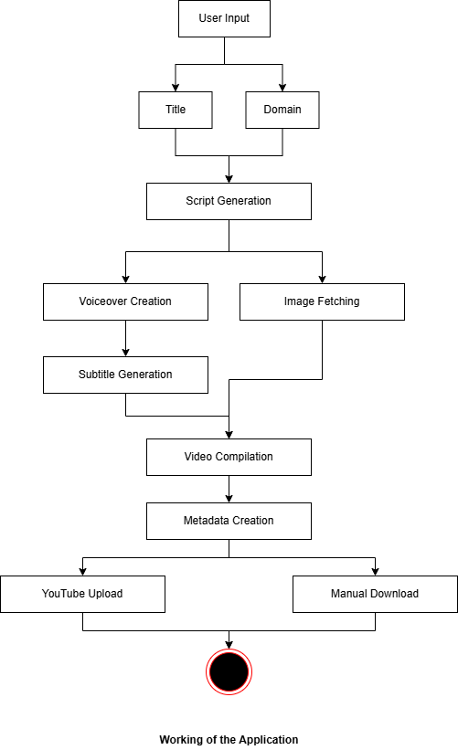

# Genify

## Overview
Genify is an AI agent that automates the content creation process for influencers and educators by eliminating the need to manually create, record, transcribe, and edit videos. It handles the entire workflow for you — and even uploads the final content directly to your social media platforms, such as YouTube.

- 🚀Live Link: https://genify-jmabeecjjebdfndbdyzusz.streamlit.app/
- 📽️Demo Video: https://youtu.be/VZxVUVM_3rE
## Features
- **Fact Generation**: Uses the Gemini API to generate scripts for short videos automatically.
- **AI Voiceovers**: Converts the generated fact into speech using the Speechify API.
- **Image Fetching**: Uses the DuckDuckGo API to retrieve relevant images based on the generated fact.
- **Video Compilation**: Leverages the MoviePy module to merge the background music (BGM), images, and AI-generated voiceovers into a short video with animations.
- **Subtitle Generation**: Uses OpenAI's Whisper module to create subtitles based on the generated voiceover.
- **Metadata Generation**: Gemini API is used again to generate an appropriate title, description, and tags for the video.
- **YouTube Upload**: Utilizes the YouTube API to upload the generated video along with the metadata.

## Dependencies
The project requires the following dependencies, specified in `requirements.txt`:
```
numpy
pandas
google-generativeai
python-dotenv
duckduckgo_search
openai-whisper
opencv-python-headless
moviepy==1.0.3
tqdm
Pillow
google-auth
google-auth-oauthlib
google-auth-httplib2
google-api-python-client
imageio[ffmpeg]
flask
streamlit
gunicorn
imageio
imageio-ffmpeg
```

## Setting Up Environment Variables
Before running the project, create a `.env` file in the root directory and paste the following:

```
GEMINI_API_KEY=your_actual_gemini_api_key
SPEECHIFY_API_KEY=your_actual_speechify_api_key
API_URL=your_actual_api_url
MIN_IMAGES=20

GOOGLE_API_KEY=your_actual_google_api_key
GOOGLE_CSE_ID=your_actual_google_cse_id

YT_CLIENT_ID=your_actual_yt_client_id
YT_CLIENT_SECRET=your_actual_yt_client_secret
YT_PROJECT_ID=your_actual_yt_project_id
YT_AUTH_URI=your_actual_yt_auth_uri
YT_TOKEN_URI=your_actual_yt_token_uri
YT_REDIRECT_URI=your_actual_yt_redirect_uri
YT_REFRESH_TOKEN=your_actual_yt_refresh_token
```

Make sure to replace `your_actual_*` values with your real API keys. The `.env` file is used to store sensitive information securely and should **not** be committed to version control. You can add `.env` to your `.gitignore` file to prevent accidental commits.

## How It Works
1. **User Input**: The user enters a title along with a domain on which the video should be
2. **Script Generation**: The script Creates a script using the Gemini API.
3. **Voiceover Creation**: Converts the text into speech using the Speechify API.
4. **Image Fetching**: Searches for relevant images using the DuckDuckGo API.
5. **Video Compilation**: Combines images, BGM, and the voiceover into an animated video.
6. **Subtitle Generation**: Generates subtitles based on the voiceover.
7. **Metadata Creation**: Creates a title, description, and tags using Gemini.
8. **YouTube Upload**: Uploads the video using the YouTube API.
9. **Manual Download**: Currently, the video can manually be downloaded to post on other platforms as well.Though this could be automated as well later.

## Flow chart

<p align="center">
  
</p>

## Running the Project Locally
To run the script manually on your local machine:
1. Clone the repository.
2. Set up API keys and environment variables in a `.env` file.
3. Install dependencies using `pip install -r requirements.txt`.
4. Run the script with `streamlit run final_app.py`.


Contributions are welcome! Feel free to fork the repository, create a new branch, and submit a pull request with improvements or new features. 🙌🏻

Happy Coding !